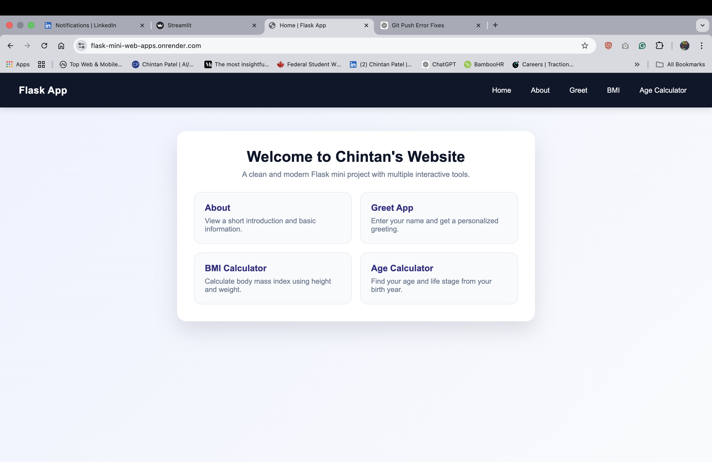
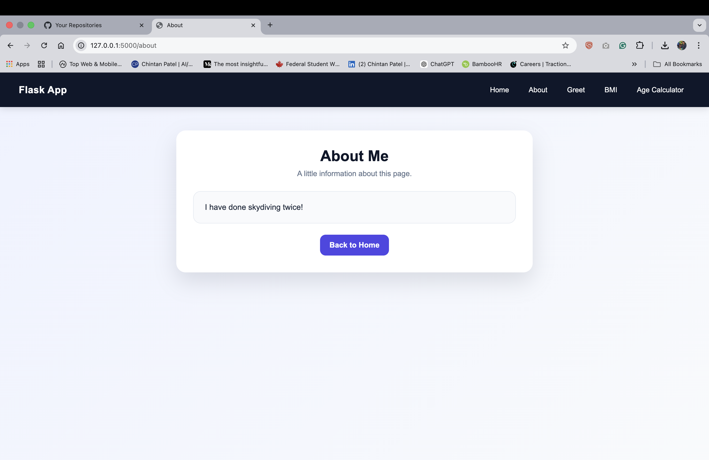
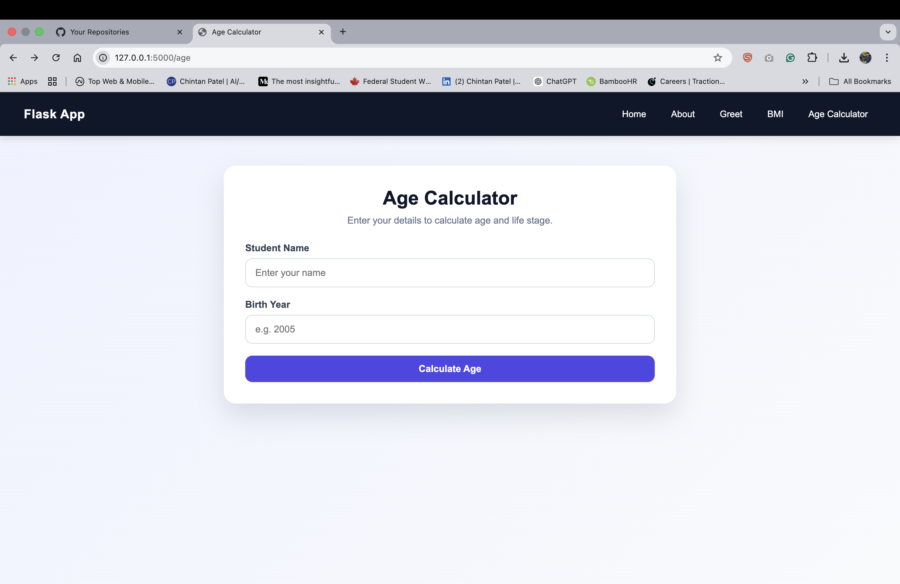
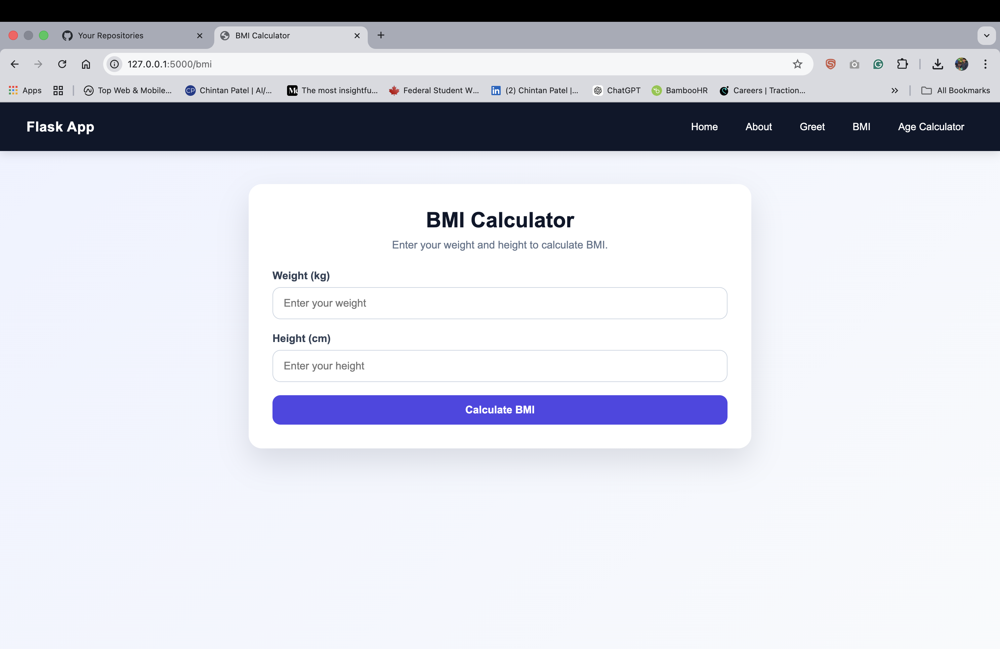
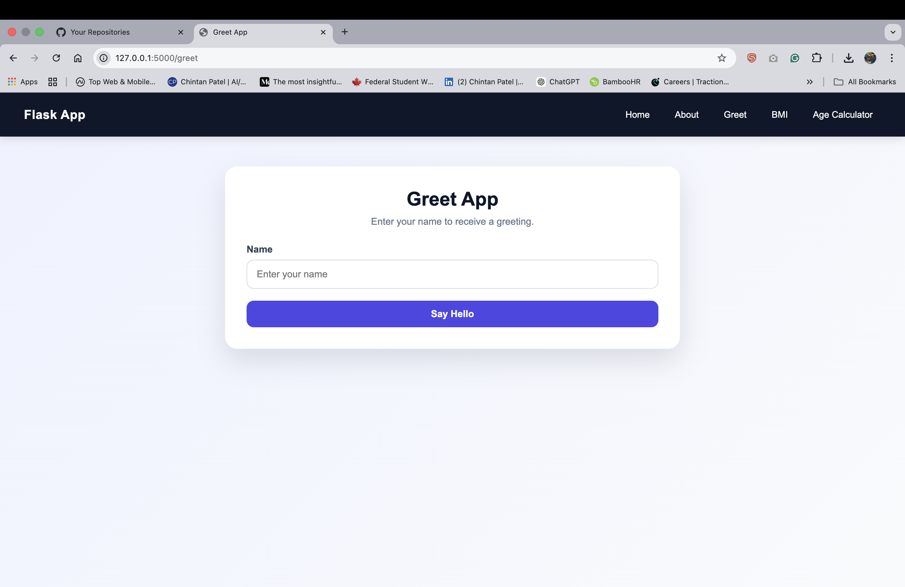

# Flask Mini Web Applications 🚀

🌐 **Live Demo:** https://flask-mini-web-apps.onrender.com/
**Description:** Flask mini web apps with live deployment.

This project is a collection of small web applications built using **Python Flask**.  
It demonstrates basic backend development concepts such as routing, form handling, conditional logic, and template rendering.

The project also includes a clean modern UI using custom CSS.

---

## 📸 App Preview

### 🏠 Dashboard

### 🔥 Home Page


### 📸 About Preview


### 🧍 Age Calculator


### BMI Calculator


### 🔥 Greet App



---


## 📌 Features

This Flask project contains multiple mini apps:

### 1️⃣ Greet App
- User enters their name
- App returns a greeting message

### 2️⃣ BMI Calculator
- User enters weight and height
- Python calculates BMI
- Displays BMI category:
  - Underweight
  - Normal
  - Overweight
  - Obese

### 3️⃣ Age Calculator
- User enters name and birth year
- Python calculates age using:

```
Age = 2026 - Birth Year
```

- Determines life stage:
  - Teen
  - Young Adult
  - Senior

### 4️⃣ About Page
Simple informational page.

---

## 🛠 Tech Stack

- Python
- Flask
- HTML
- CSS
- Jinja2 Templates

---

## 📂 Project Structure

```
flask-mini-apps/
│
├── app.py
├── requirements.txt
├── README.md
│
├── static/
│   └── style.css
│
├── templates/
│   ├── home.html
│   ├── about.html
│   ├── greet_form.html
│   ├── greet_result.html
│   ├── bmi_form.html
│   ├── bmi_result.html
│   ├── age_form.html
│   └── age_result.html
```

---

## ⚙️ Installation

Clone the repository:

```bash
git clone https://github.com/chintan-02/flask-mini-web-apps.git
```

Go to project folder:

```bash
cd flask-mini-apps
```

Install dependencies:

```bash
pip install -r requirements.txt
```

Run the app:

```bash
python app.py
```

Open browser:

```
http://127.0.0.1:5000
```

---

## 📸 Screenshots

### Home Page
(Add screenshot here)

### Age Calculator
(Add screenshot here)

---

## 🎯 Learning Outcomes

Through this project I practiced:

- Flask routing
- Handling GET and POST requests
- Form processing
- Conditional logic in Python
- HTML templates with Jinja
- Building simple UI with CSS
- Structuring a Python web project

---

## 🚀 Future Improvements

- Add database integration
- Add user authentication
- Convert UI to Bootstrap / React
- Deploy on cloud (Render / AWS / Heroku)

---

## 👨‍💻 Author

**Chintan Patel**  
🔗 GitHub: https://github.com/chintan-02  
🌐 Live App: https://flask-mini-web-apps.onrender.com/
